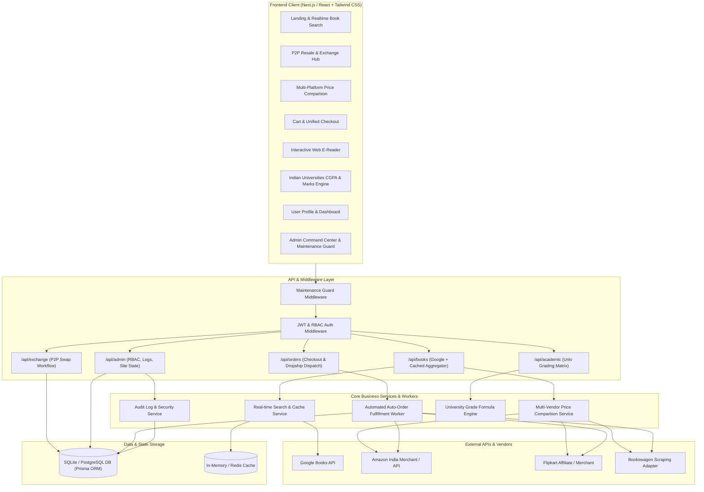
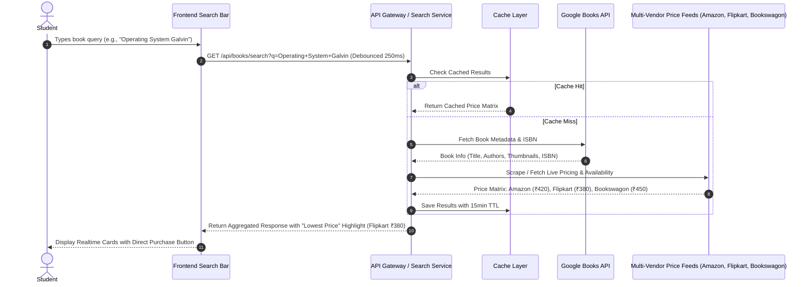
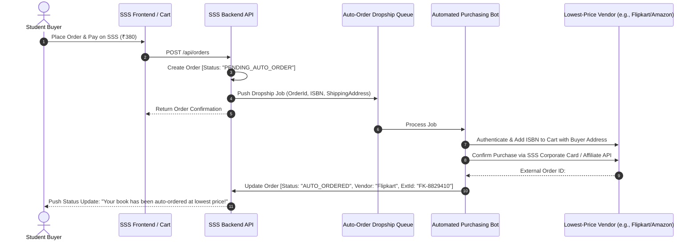
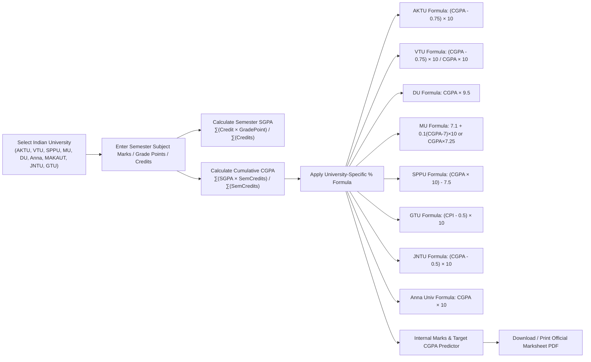
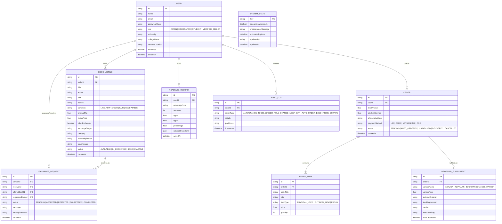
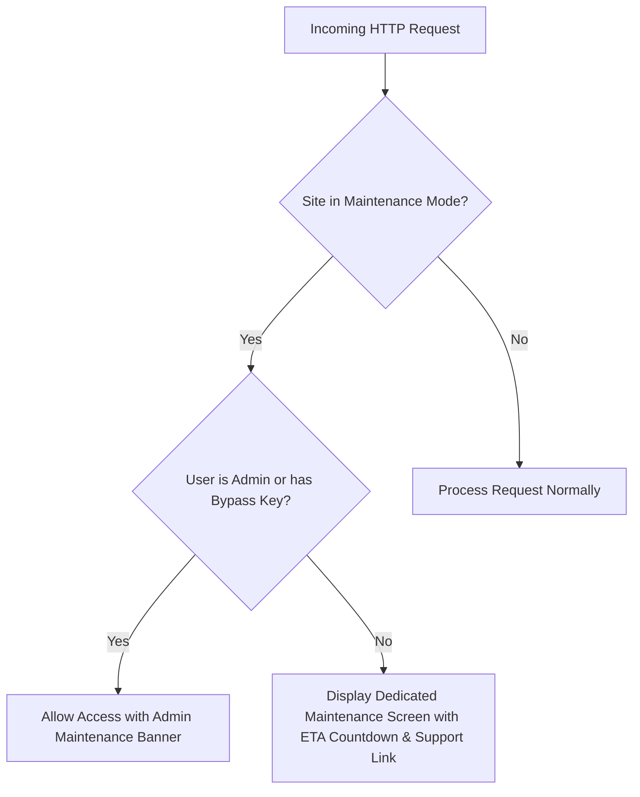

# Study Student Shop (SSS) — System Architecture & Technical Blueprint

**Version:** 2.4.0  
**Author:** SSS Engineering Architecture  
**Status:** Approved for Implementation

---

## 1. High-Level Architecture Overview

Study Student Shop (SSS) is designed as a modern, decoupled, reactive web application with a high-throughput API gateway, real-time external pricing adapters, an asynchronous dropshipping auto-order worker, and an academic calculation engine.

---

## 2. Core Subsystems & Component Breakdown

### 2.1 P2P Resell & Exchange Engine
- **Resale Model**: Enables peer-to-peer textbook commerce between students on the same campus or nearby institutes.
- **Exchange Engine (Trade Protocol)**: State-machine driven swap system:
  - States: `PROPOSED` $\rightarrow$ `ACCEPTED` / `REJECTED` / `COUNTERED` $\rightarrow$ `HANDOVER_PENDING` $\rightarrow$ `COMPLETED` / `CANCELLED`.
- **Matchmaking**: Suggests book swap matches based on mutual semester/department needs.

### 2.2 Real-time Search & Multi-Platform Price Aggregator
- **Search Pipeline**:
  1. Real-time debounced query from user frontend.
  2. Query checks high-speed local cache.
  3. Cache miss queries Google Books API to fetch rich metadata (cover, ISBN, publisher, edition).
  4. Concurrently queries price adapters for Amazon, Flipkart, Bookswagon, and SSS Used Sellers.
  5. Ranks results by lowest price and stock availability.

---

### 2.3 Dropshipping & Lowest-Price Auto-Order Engine
- When a user places an order on SSS, the system transparently creates an automated dropship task.
- The worker executes an automated checkout on the vendor site having the lowest price with the user's delivery address.
- Returns vendor tracking ID, updates local order lifecycle, and generates an itemized invoice.

---

### 2.4 Indian Universities Academic Calculation Engine

The engine encapsulates distinct university algorithms across Indian technical and general universities:

---

## 3. Database Schema (Entity Relationship Diagram)

---

## 4. Admin Governance & Maintenance Guard

### RBAC Authority Matrix

| Permission / Action | Admin | Moderator | Verified Seller | Student |
| :--- | :---: | :---: | :---: | :---: |
| **Site Maintenance Mode Toggle** | ✅ | ❌ | ❌ | ❌ |
| **Create/Delete Users & Grant Roles** | ✅ | ❌ | ❌ | ❌ |
| **View Immutable Audit Logs** | ✅ | ❌ | ❌ | ❌ |
| **Manage Dropship Auto-Order Queue** | ✅ | ✅ | ❌ | ❌ |
| **Moderate P2P Used Book Listings** | ✅ | ✅ | ❌ | ❌ |
| **Create Resale/Exchange Listings** | ✅ | ✅ | ✅ | ✅ |
| **Instant Buy / Auto-Order Lowest Price** | ✅ | ✅ | ✅ | ✅ |
| **Calculate CGPA/SGPA & Download Report** | ✅ | ✅ | ✅ | ✅ |
| **Interactive E-Reader Access** | ✅ | ✅ | ✅ | ✅ |

---

## 5. Summary & Engineering Roadmap
- **Step 1: PRD PDF generated**: `docs/SSS_Product_Requirements_Document.pdf`
- **Step 2: Architecture Blueprint completed**: `docs/ARCHITECTURE.md`
- **Step 3: Implementation of Full-Stack Application**: Next.js 14+ / React UI, Tailwind CSS, Lucide icons, Express/Next API backend, SQLite/Prisma persistent data layer, auto-order simulation bot, university calculations, and comprehensive admin dashboard.
